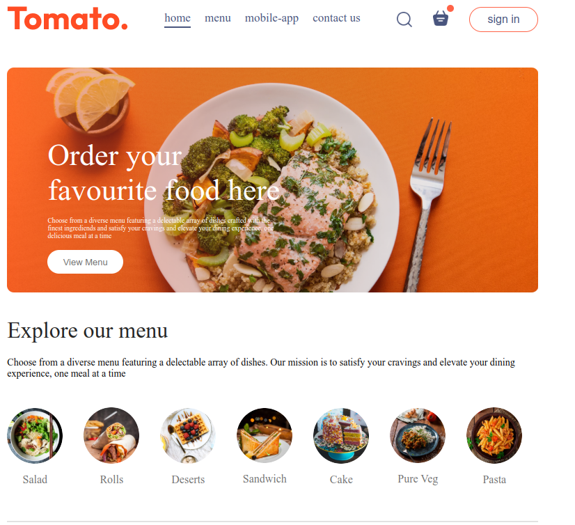

# Food Delivery App

A modern food delivery web application built with React and Vite.



## 📋 Overview

This food delivery application offers a seamless experience for users to browse menus, place orders, and track deliveries. With an intuitive interface and responsive design, users can easily navigate through various food options, customize their orders, and complete payments.

## ✨ Features

- **User Authentication**: Secure login and registration system
- **Menu Exploration**: Browse food items by categories
- **Food Details**: View detailed information about each dish
- **Shopping Cart**: Add, remove, and modify items in your cart
- **Order Placement**: Seamless checkout process
- **Responsive Design**: Works on desktop and mobile devices

## 🛠️ Tech Stack

- **Frontend Framework**: React.js
- **Build Tool**: Vite
- **Styling**: CSS Modules
- **State Management**: React Context API
- **Routing**: React Router
- **Other Dependencies**: (Add any additional libraries used)

## 🚀 Getting Started

### Prerequisites

- Node.js (v14.0.0 or later)
- npm or yarn

### Installation

1. Clone the repository
```bash
git clone https://github.com/odokclement/food-delivery.git
cd food-delivery
```

2. Install dependencies
```bash
npm install
# or
yarn install
```

3. Start the development server
```bash
npm run dev
# or
yarn dev
```

4. Open your browser and navigate to `http://localhost:5173`

## 📁 Project Structure

```
food-delivery/
├── node_modules/
├── public/
├── src/
│   ├── assets/
│   ├── Components/
│   │   ├── AppDownload/
│   │   ├── ExploreMenu/
│   │   ├── FoodDisplay/
│   │   ├── FoodItem/
│   │   ├── Footer/
│   │   ├── Header/
│   │   ├── LoginPopup/
│   │   └── Nav/
│   ├── context/
│   ├── Pages/
│   │   ├── Cart/
│   │   ├── Home/
│   │   └── PlaceOrder/
│   ├── App.jsx
│   ├── index.css
│   └── main.jsx
├── .eslintrc.cjs
├── .gitignore
├── index.html
├── package.json
├── README.md
└── vite.config.js
```

## 🔧 Available Scripts

- `npm run dev` - Start the development server
- `npm run build` - Build the app for production
- `npm run preview` - Preview the production build locally
- `npm run lint` - Run ESLint to check code quality

## 🌐 Deployment

To deploy the application to production:

1. Build the project
```bash
npm run build
# or
yarn build
```

2. The build artifacts will be stored in the `dist/` directory, which can be deployed to any static hosting service like Netlify, Vercel, or GitHub Pages.

## 🤝 Contributing

1. Fork the repository
2. Create your feature branch (`git checkout -b feature/amazing-feature`)
3. Commit your changes (`git commit -m 'Add some amazing feature'`)
4. Push to the branch (`git push origin feature/amazing-feature`)
5. Open a Pull Request

## 📄 License

This project is licensed under the MIT License - see the LICENSE file for details.

## 👤 Author

Odock Clement - [Email Link](mailto:odokclement@gmail.com) - [Github](https://github.com/odokclement)

## 🙏 Acknowledgements

- [React](https://reactjs.org/)
- [Vite](https://vitejs.dev/)
- [React Router](https://reactrouter.com/)
- Any other libraries or resources used
